# Gap-Graph User Guide


### 1、Software Introduction

Gap-Graph is a visual tool designed to assist in genome assembly. It provides functionalities for visualizing genome assembly graphs, chromosome visualizations, locating and visualizing genomic gap regions, gap filling, and manual genotyping of polyploid genomes. This software can help researchers quickly and efficiently complete the filling of genomic gaps.

#### Language：[English](./README.md)  | [中文](./README_cn.md)

### 2、Installation

Users can download and install Gap-Graph through the following link. Simply double-click to install. The download link is: https://github.com/panlab-bioinfo/Gap-graph/releases

### 3、Software Usage Instructions

##### Pre require：

[Minimap2](https://github.com/lh3/minimap2) >= 2.26-r1175

[GraphAligner](https://github.com/maickrau/GraphAligner) >= 1.0.13

[HapHic](https://github.com/zengxiaofei/HapHiC) >= 1.0.6

[bwa](https://github.com/lh3/bwa) >= 0.7.18-r1243-dirty

[samblaster](https://github.com/GregoryFaust/samblaster) >= 0.1.26

[samtools](https://github.com/samtools/samtools) >= 1.20

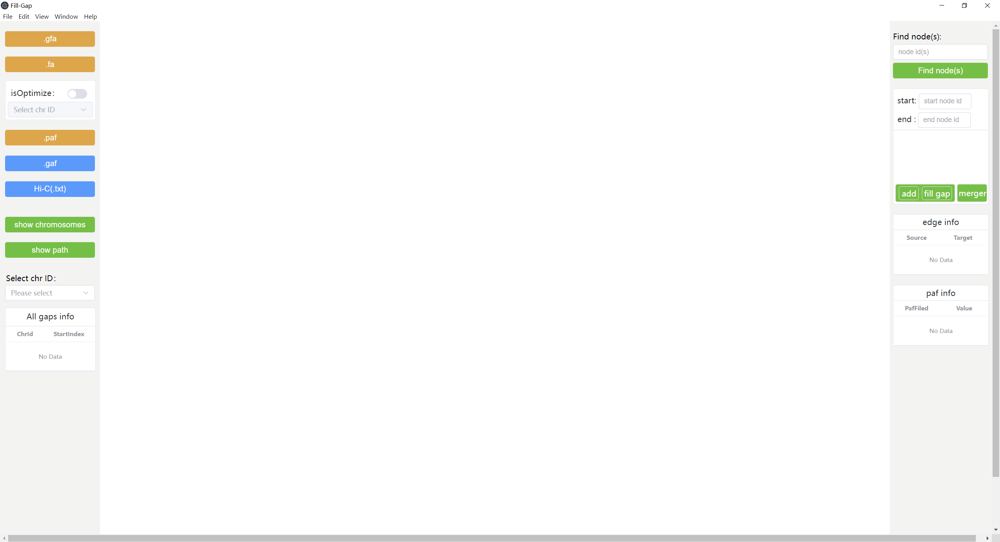  

 

1、  To properly use the gap-filling function, the yellow button requires the following uploaded files:

   1）.gfa file: The .gfa file is the unitig assembly graph file generated using an automated assembly software (such as hifiasm or flye, hifiasm is recommended).

   2）.fa file: The .fa file contains the chromosome level assembly generated by the automated assembly software. The format of fa must be make sequence in the next line of the name line. Such as:  
   
```
# example fa format
>id1_seq
AATTCTCTTGCTCGCTGCT
>id2_seq
CGCGCGGCTCTCTTTC
......
```

   3）.paf file: The .paf file is the alignment result of the unitig sequences mapped to the chromosome assembly using minimap2.

You can use the following command to obtain the .paf file. Be sure to replace the file paths with the correct ones:

```
minimap2 -x asm5 -t 32 assembly.fa unitig.fa > result.paf
```

2、  If you want to view more information, you can upload the .gaf file and Hi-C file:

   1）.gaf file: The .gaf file is the alignment result of ONT reads mapped to the unitig assembly graph using GraphAligner.

You can use the following command to obtain the .gaf file. Be sure to replace the file paths with the correct ones:

```
GraphAligner -g unitig.gfa -f ont.fa -a result.gaf -x vg
```

   2）Hi-C (.txt) file: The .txt file contains the result of aligning and filtering Hi-C data against the unitig sequences using bwa (here, the filtering method of HapHic is referenced). The first and second columns contain the utg IDs, and the third column contains the Hi-C signal values.

You can use the following command to obtain the .txt file. Be sure to replace the file paths with the correct ones:

```
bwa mem -5SP -t 28 unitig.fa ont.read1_fq ont.read2_fq | samblaster | samtools view - -@ 14 -S -h -b -F 3340 -o HiC.bam

 

filter_bam HiC.bam 1 --nm 3 --threads 14 | samtools view - -b -@ 14 -o HiC.filtered.bam

 

samtools view HiC.filtered.bam | awk '($7 != "=" && $3 != $7 )' | cut -f1,3,7 |awk '{if($1 != seq){seq=$1;print $0;}}'| awk '{if($2>$3){temp=$2;$2=$3;$3=temp}print $2"\t"$3}' | sort | uniq -c | awk '{print $2","$3","$1}' > hic.txt
```

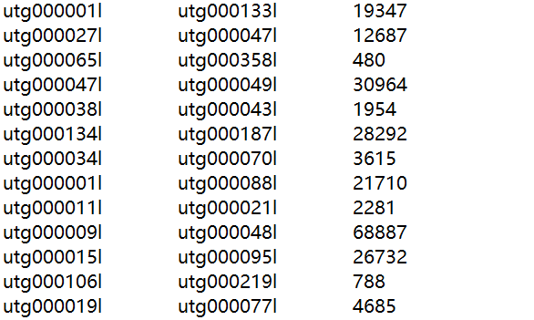  

 

3、 After uploading the .gfa file, the assembly graph will be automatically visualized, as shown in the images below:

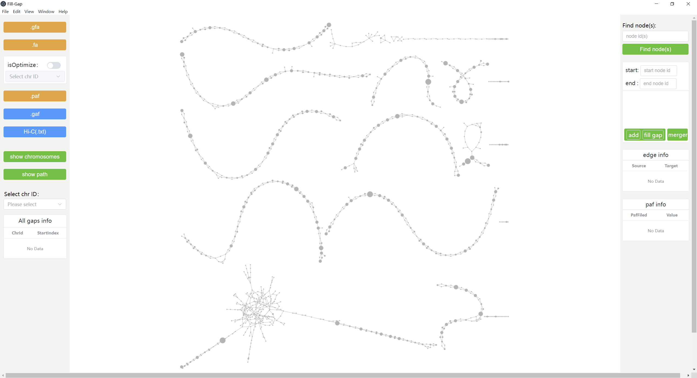  

 

4、After uploading the .paf file, the software will automatically align the chromosome assembly to the assembly graph. You can then select the chromosome ID to view each chromosome. If some chromosomes are not successfully mounted or are unsatisfactory, you can manually enable the optimization algorithm. After selecting one or more chromosomes you wish to optimize, re-upload the .paf file to optimize the chromosome mounting.

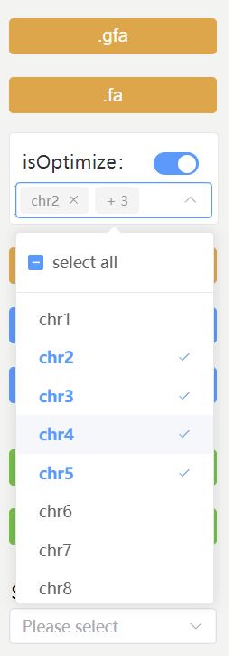  

 

5、After uploading the .paf file, the "All gaps info" card will display all the gap information in the chromosome assembly, as shown in the images below:

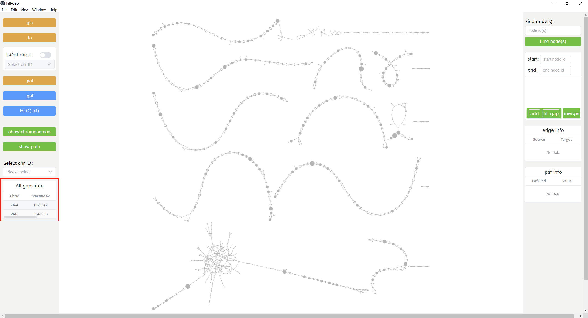  

 

6、 After uploading the .paf file, click the "show chromosomes" button to display the mounted chromosomes, and the positions of gaps will be shown on the graph (red nodes represent the start and end of the gap areas). You can also choose to display a single chromosome.

Note: The number of gaps displayed on the graph may be fewer than the number of gaps shown in the "All gaps info" card.

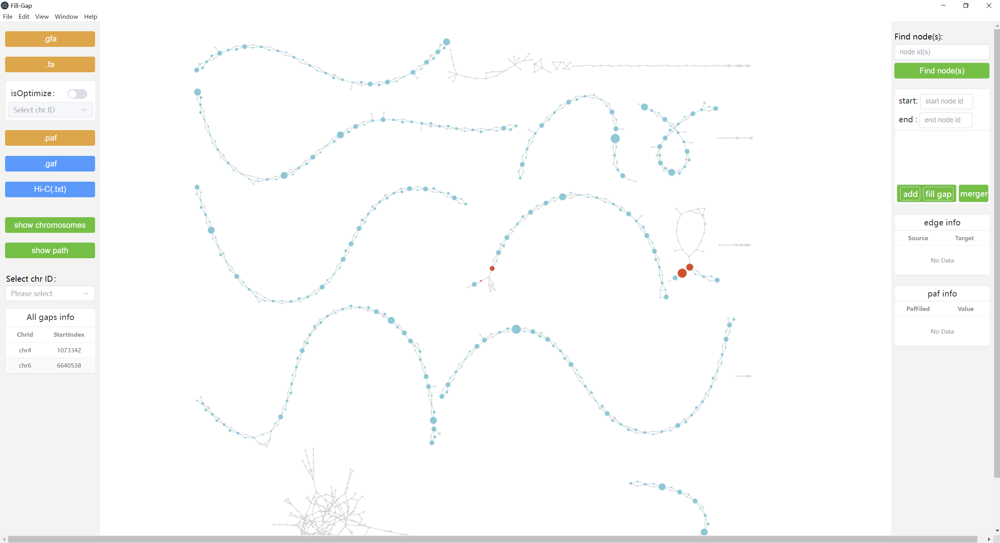  

 

7、 When you hover the mouse over a node, the node's label will be displayed. The first field of the label is the utg ID, the second field is the length of the utg, and the third field is the position of the utg on the current chromosome, as shown in the images below:

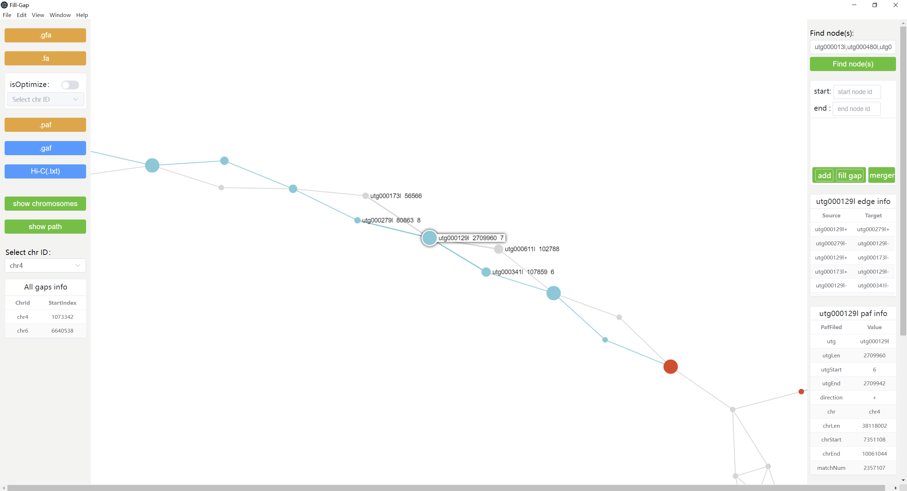  

 

8、After uploading the .gaf file, click the "show path" button to display the depth of each path, as shown in the images below:

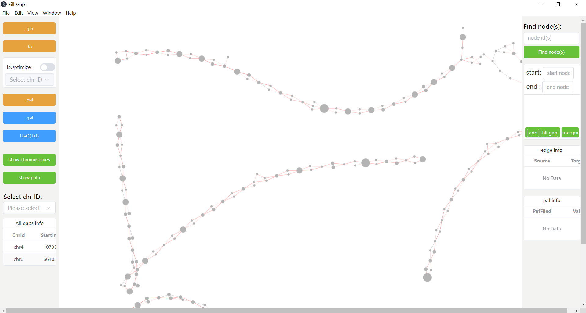  


9、After upoading the .gaf file, right-click on a node and click the "show cover degree" button to display the coverage degree of other nodes (purple) relative to the current node (yellow). The darker the color of the other nodes, the higher the coverage degree, as shown in the images below:

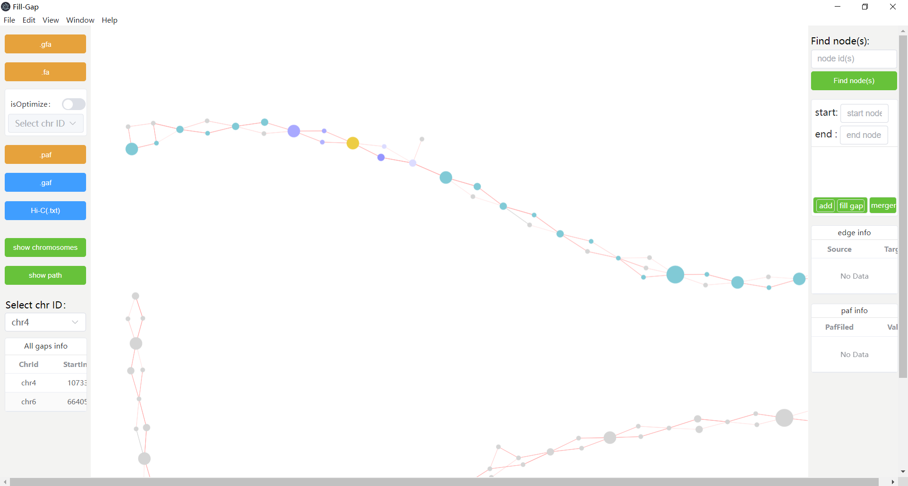  


10、 After uploading the Hi-C (.txt) file, right-click on a node and click the "show Hi-C" button to display the Hi-C signal strength between other nodes (blue) and the current node (yellow). The darker the color of the other nodes, the stronger the signal, as shown in the images below:

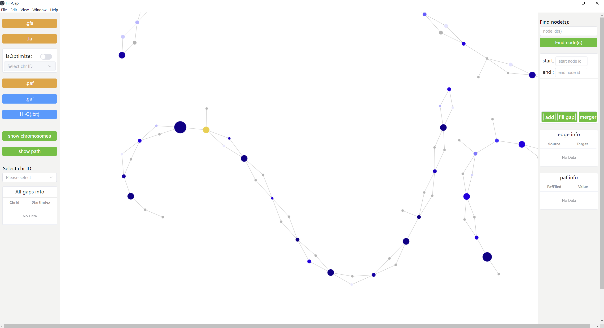  


11、 After selecting a chromosome, click on a node within the chromosome, and the edge information and alignment details related to that node will be displayed on the right side of the interface, as shown in the images below:

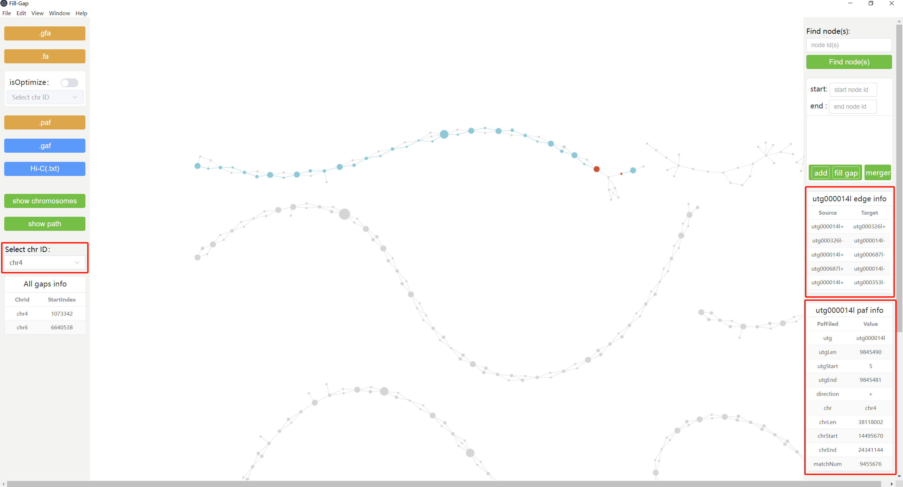  

 

12、 The input box in the top-right corner of the interface allows you to enter the nodes you want to search for (if searching for multiple nodes, separate them with commas). After clicking the search button, the nodes will be highlighted in the graph, as shown in the images below:

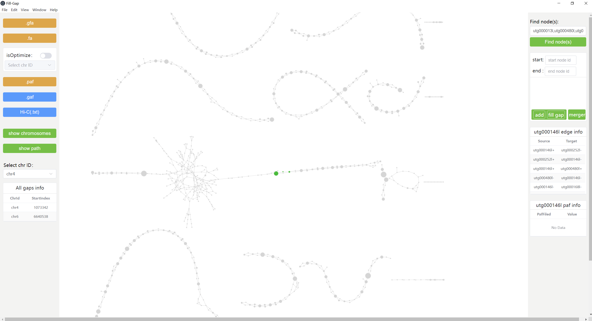  


### 4、Core Functionality Description**

1、 fill gap: Find the gap position to be filled (red node). Add nodes with smaller mounting order to the starting node, and nodes with larger mounting order to the ending node. Then, sequentially add the nodes to be filled by pressing "ctrl + left-click" on the nodes. Afterward, click the "add" button to complete the addition of the gap information. If multiple gaps need to be filled in a chromosome, repeat the above steps until all gap information is added. Finally, click the "fill gap" button to complete the gap filling.

Note:

   1）If you're unsure which nodes to add to fill the gap, you can upload the .gaf or Hi-C (.txt) files to display more information for reference, and choose the most reliable path.

   2）The generated sequence will be saved in the same directory as the uploaded .fa file.

2、 merger: This function allows for the merging of all utg sequences based on the added node information. It similarly requires adding the start and end nodes, and then sequentially adding the nodes to be merged (ctrl + left-click on the nodes). Afterward, simply click the "merger" button to complete the merging process. This function can be used for genotyping (based on certain information, such as uploading .gaf or Hi-C (.txt) files, choosing a reliable path, and merging it into a longer sequence).

 

